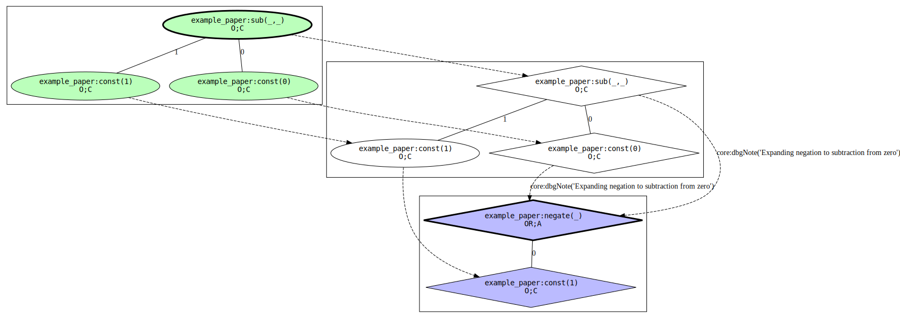
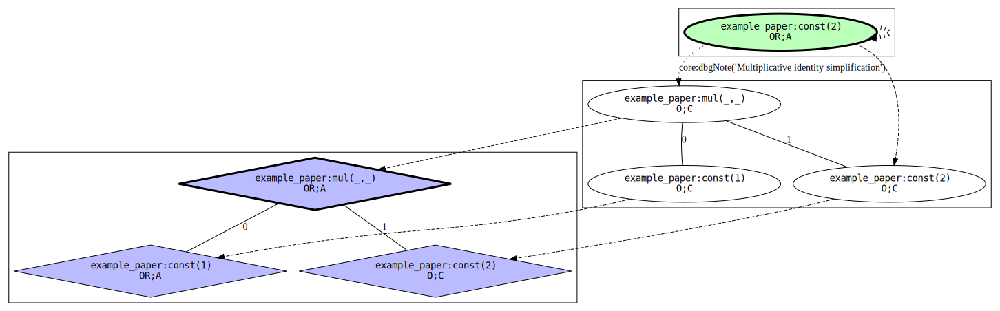

* Contents
{:toc}


## High level

Silver can track the origins of nonterminals constructed in programs.
This is implemented following the paper [Origin Tracking in Attribute Grammars by Kevin Williams and Eric Van Wyk.](https://www-users.cs.umn.edu/~evw/pubs/williams14sle/index.html)
More simply: each node (instance of a nonterminal type) gains an additional piece of information called it's origin, which is a reference to the node that it 'came from.'
It may also have a similar reference called the redex to a node that catalyzed the motion of the node from one place in the tree to another.
It also gains a marker called 'er' that indicates if the transformation that produced it was trivial or not, and gains a set of 'notes' that describe the transformation that produced it.

When a node is constructed it's origin is set to the node on which the rule that constructed it was evaluated.
For example, if a node representing an expression has a rule for an attribute that constructs an expanded version of it, all of the nodes newly constructed in that rule gain the original node as their origin.
When a attribute is defined to be an attribute of a child, the value assigned to the attribute is a copy of that child with it's redex set to the node on which that rule occurs.
The redex then represents the node that catalyzed the movement of the child to the parent's position in the resulting value.


## I don't care about the theory - someone told me I could use this instead of the location annotation

OK.
 1. Mark everything that has a `location` annotation as `tracked`
 2. Get rid of the `location` annotation and associated swizzling
 4. Instead of using `top.location` for error messages instead raise errors/etc with `errFromOrigin(top, ...)`/etc
 5. Start building your project with `--no-redex` instead of `--no-origins` (if you were) and build it `--clean`ly [at least once](#build-issues)

In cases where swizzling was not just `location=top.location` you an add an `attachNote logicalLocationNote(loc);` statement, getting `loc` from `getParsedOriginLocationOrFallback(node)`.
This statement means that that a node constructed in the body alongside that statement is traced back to a textual location that location will be used instead of the textual location of the node on which the rule was defined.


## Origins in Silver

Nonterminals in silver are either `tracked` (which is a qualifier like `closed`) or untracked.
Tracked nonterminals have origin information attached to them at construction (and if using redexes, when they are 'moved' during a transformation.)
Untracked nonterminals don't have origin info.
There are performance implications for keeping track of origins info (both in constructing the origins info representations, doing the bookkeeping for them, and the memory overhead of pinning the things objects originate from) so it is in one's best interest to avoid tracking nonterminals that won't have their origins information asked for.

In Silver the origin of a node is represented as an instance of the nonterminal type `OriginInfo`, which has different productions for different sets of origin information a node can have.
To access the `OriginInfo` for a node one calls `getOriginInfo` (in `core`) which returns a `Maybe<OriginInfo>`.
Code using origins should handle the case that this returns `nothing()`.
The links to origins and redexes in `OriginInfo` nodes are implemented as unconstrained generics, so to handle them it is necessary to use reflection.
If you want to checked-cast a link to a known type you can use the `reify(anyAST(link))` pattern to do so without unnecessarily constructing a reflective tree.
This can fail either if a terminal is not marked as `tracked`, because the program was built with `--no-origins`, or because of a stale module not attaching origins (see later note on [build issues](#build-issues).)

In Silver notes are values of the type `OriginNote`.
A builtin `dbgNote ::= String` production is available for quick debugging notes, but for other use users are encouraged to add their own productions.
Notes are effective over domains of code and will be picked up in the origins info for any values constructed (in their origin notes) or moved (in their redex notes) in that code (and in functions it calls, etc.)
Notes can be made effective over an entire body of statements by adding a production statement of the form `attachNote dbgNote("foo");` or made effective over only part of an expression by writing `attachNote dbgNote on {expr}`.
The former is useful to describer a general operation happening, and the latter for noting a exceptional case (e.g. a nontrivial optimization taking place sometimes.)

In Silver the 'er' flag on origins is known as 'newlyConstructed' or 'isInteresting'.
The definition used to determine if a constructed node is interesting is that it _is_ considered interesting unless all of the following are true:
 - It's in the 'root position' of a rule, i.e. `bar()` is in 'root position' in `top.xform = bar()` but not in `top.xform = foo(bar())`.
 - It's the same production as the production on which the rule is defined, i.e. `...production bar... {top.xform=bar(...);}` but not `...production bar... {top.xform=foo(...);}`
 - It's not constructed in a function (including lambdas)

The purpose of this flag is to indicate if the transformation is 'trivial' or not.
If the flag is not set you can know that the transformation didn't change the 'shape' of the tree at the level of the node on which it's set.

We can follow the origin link of a node to the node it logically originates from.
Once we can do this, we can get the origin information of that node, and follow the path of origins back.
This is the 'origins chain' or 'origins trace'.
Eventually we will reach a node that has an origin describing some source other than a rule on a node (instead e.g. that it was parsed from input to Copper) or a node without origins (because it is not `tracked`.)
One can call `getOriginInfoChain` to get a list of `OriginInfo` objects representing the links between objects in this chain.
If the chain of origins is `foo ---originates-from-node---> bar ---originates-from-node---> baz ---originates-from-source-location---> file:12:30` we can call `getOriginInfoChain(foo)` to get `[originOriginInfo(..., bar, ...), originOriginInfo(..., baz, ...), parsedOriginInfo(loc('file', 12, 30, ...))]`.
One very practical application is that we can get this chain of origin information, find the last one, and find the source location the object at the end of the chain originates from.
This is what we currently do with the `location` annotation in many places.
This common use case is wrapped up with the helper functions `getUrOrigin(...)` which returns the last item in the origin chain (if there is one) and `getParsedOriginLocation(...)` which gets the last item in the origin chain and - if it is a `parsedOriginInfo` indicating it was constructed in Copper - yields the `Location`.
In situations where the logical textual origin of a node is not the textual origin of the node on which the rule which constructed it was defined one can attach a `logcialLocationNote(loc)` to it which will be used by `getParsedOriginLocation` instead.


## Origin Types in Silver

In Silver the notion from the paper is extended and generalized to provide origins that can also encode different ways of producing nodes that are not part of the simple attribute grammar described in the paper.
Each different set of possible origin info is described by a production of `OriginInfo`.
Each production has a `OriginInfoType` member that describes where and how the node was created and contains a list of `OriginNotes` attached from code that influenced the creation of the node.
 - `originOriginInfo(typ, origin, originNotes, newlyConstructed)` contains a link to the node that this node originates from (`origin`), notes (`originNotes`) and the interesting flag (`newlyConstructed`). The possible values for `typ` (`OriginInfoType`s) are:
   - `setAtConstructionOIT()` indicating the node was constructed normally. The origin link is to the node on which the rule that constructed this node occured.
   - `setAtNewOIT()` indicating the node was constructed in a call to `new` to undecorate something. The origin link is to the node that was `new`ed.
   - `setAtForwardingOIT()` indicating the node was forwarded to. The origin link is to the node that was forwarded to (see later, this is weird.)
   - `setFromReflectionOIT()` indicating the node is an `AST` created from `reflect`. The origin link is to the node that was reflected on.
   - `setFromReificationOIT()` indicating the node was created from an `AST` by `reify`. The origin link is to the reflective representation the node was reified from.
 - `originAndRedexOriginInfo(typ, origin, originNotes, redex, redexNotes, newlyConstructed)` contains a link to the node that this node originates from (`origin`), notes on that link (`originNotes`), a link to the node that is the redex of a transformation that moved this node (`redex`), notes on that link (`redexNotes`), and the interesting flag (`newlyConstructed`). The only value for `typ` this can have is `setAtAccessOIT()`.
 - `parsedOriginInfo(typ, source, notes)` contains a source location (`source`) of the text that caused Copper to emit this node from parsing (appears only on `concrete` productions.) The only value for `typ` this can have is `setFromParserOIT()`. `notes` is currently unused.
 - `otherOriginInfo(typ, source, notes)` contains a string describing whatever circumstance produced this node (`source`) and maybe `notes`. This is a catchall for things that do not have a logical origin either due to implementation details or concepts not present in the paper. Possible values for `typ` are:
   - `setFromParserActionOIT()` indicating the node was constructed in a parser action block.
   - `setFromFFIOIT()` indicating the node was constructed in a context where origins information had been lost as a result of passing through a FFI boundary that does not preserve it (e.g. when something is constructed in a comparison function invoked from the java runtime Silver value comparator shim)
   - `setFromEntryOIT()` indicating the node was constructed in entry function
   - `setInGlobalOIT()` indicating the node is a constant


## Example

The following silver code approximates the example attribute grammar used in the Origin Tracking in Attribute Grammars paper linked above:

```
tracked nonterminal Expr;
synthesized attribute expd :: Expr occurs on Expr;
synthesized attribute simp :: Expr occurs on Expr;

abstract production const
top::Expr ::= i::Integer
{
  top.expd = const(i);
  top.simp = const(i);
}

abstract production add
top::Expr ::= l::Expr r::Expr
{
  top.expd = add(l.expd, r.expd);
  top.simp = add(l.simp, r.simp);
}

abstract production sub
top::Expr ::= l::Expr r::Expr
{
  top.expd = sub(l.expd, r.expd);
  top.simp = sub(l.simp, r.simp);
}

abstract production mul
top::Expr ::= l::Expr r::Expr
{
  top.expd = mul(l.expd, r.expd);
  top.simp = case l.simp of
             | const(1) -> attachNote dbgNote("Multiplicative identity simplification")
                           on {r.simp}
             | _ -> mul(l.simp, r.simp)
             end;
}

abstract production negate
top::Expr ::= a::Expr
{
  attachNote dbgNote("Expanding negation to subtraction from zero");
  top.expd = sub(const(0), a.expd);
  top.simp = error("Requested negate.simp");
}
```

Computing the transformation of a tree is accomplished by demanding `expd` on the tree and then `simp` on the result (for a tree `x` the transformation is `x.expd.simp`.)
The following diagrams visualize the origins connections between the resulting value (`x.expd.simp`) and the original value (`x`.)
The nodes in green are parts of the output value (the value itself has a bold border) and the nodes in blue are part of the input value (similarly.)
Dashed lines represent origin links and dotted lines represent redex links.
Wide dashed lines represent contractum domains (essentially what is the most immediate parent on which a location-changing transformation occurred... read the paper for a formal description.)
Diamond-shaped nodes indicate the interesting/'er' flag is set on that node's origin info.

In this specific example grammar the green nodes are then `x.expd.simp`, the white nodes are `x.expd` and the blue nodes are `x`.
Due to implementation details the input tree is marked interesting (it is interesting if you consider that it's a nontrivial translation from a different CST type) but you can ignore that for the purpose of the explanation.

The tree `negate(const(1))` expands to `sub(const(0), const(1))` and then simplifies (a no-op) to `sub(const(0), const(1))`:



We can see that the simplified copy of `const(1)` originates from the expanded copy which originates from the original copy.
Since the transformations for `const` are noops (the shape of the rule `top.expd = const(i)` trivially mirrors the shape of the production `production const top::Expr ::= i::Integer`) the expanded and simplified nodes are ovals, indicating that the rule that produced them was not 'interesting'.
We can also see that generally since the simplification for this tree are all 'boring' simplified nodes originate from the expanded nodes and are not marked interesting (are ovals).
More interesting is the step that converted the `negate` to a `sub`.
We can see that the `sub` node and the `const(0)` node are both marked as originating from the `negate` node - this is because they were produced by expressions in a rule that was evaluated on that node.
We can also see the `dbgNote` attached to the origin info for the `const(0)` and `sub` nodes (in the `originNotes` field).
The note does not appear on the origin of the `const(1)` because it was not manipulated in a nontrivial way in the rule for `expd` on `negate`.

The tree `mul(const(1), const(2))` expands to `mul(const(1), const(2))` and then simplifies to `const(2)`:



We can see that since the expansion step is a noop the nodes are marked uninteresting and originate simply.
The interesting change is the simplification step. The `mul(const(1), const(2))` reduces to just `const(2)` - the `mul` and `const(1)` nodes disappear and the `const(2)` is in the resulting tree in the location that the `mul` originally was.
We can see that the resulting `const(2)` originates as expected from the `const(2)` in the expanded tree, but has an additional dotted line ot the `mul` node for it's redex.
This means that the `simp` rule on the `mul` node catalyzed the motion of the `const(2)` from it's previous position in the tree to it's new position where the `mul` node was.
We can also see that the redex edge for the `const(2)` node in the output has the `dbgNote` from the simplification case of the match attached to it (as a member of the `redexNotes` - but not `originNotes` - list.)
This is because the node was effective over the expression that moved the `const(2)` to it's resulting position (`r.simp` in the `simp` rule for `mul`) but not the expression that constructed it (`top.simp = const(i)` in `const`.)


## Compiler Flags

There are a few compiler flags that can be passed to `silver` to control origins tracking behaviour:
 - `--force-origins` causes the compiler to treat every nonterminal as if it was marked `tracked`. This is very useful for playing around with origins in an existing codebase and for figuring out what you need to track (build wiht `--force-origins`; look at origins trace; track everything included.) This can be pretty (+15% to +30% vs no origins) slow.
 - `--no-origins` does the opposite, causing the compiler to completely disable origins, including the context swizzling machinery in generated code. This is recommended if you aren't going to use them since it will remove almost all overhead in generated code.
 - `--no-redex` causes the code to not track redexes. Redexes are a neat feature and a cool part of the theory but not neccesary if all you want to do is avoid having to use a `location` annotation for error messages. This can be somewhat (5%) faster than leaving redexes on if you aren't using them.
 - `--tracing-origins` causes the code to attach notes indicating the control flow path that lead to constructing each node to it's origins. This can be a neat debugging feature, but is also quite slow.


## Build Issues

Because of [the issues with the silver build system](https://github.com/melt-umn/silver/issues/36) it's possible to get in situations where either semantically wrong code (no origins when there should be), inefficient code, or crashing code is generated if `--clean` is not used after changing compiler flags or trackedness of nonterminals.
To avoid this: **rebuild with `--clean` every time you (1) change the `tracked`ness of something or (2) change any of the compiler flags relating to origins (`--force-origins`, `--no-origins`, `--no-redex`, `--tracing-origins`.)**
TODO: Fix #36 and resolve this issue.